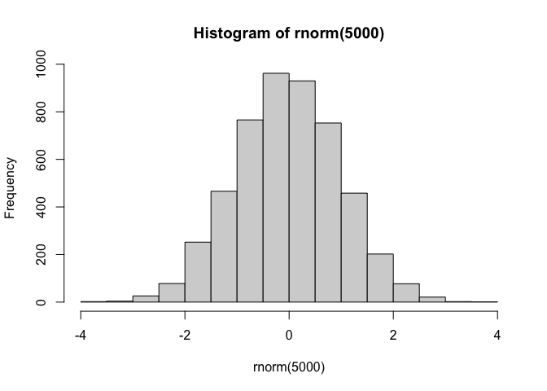
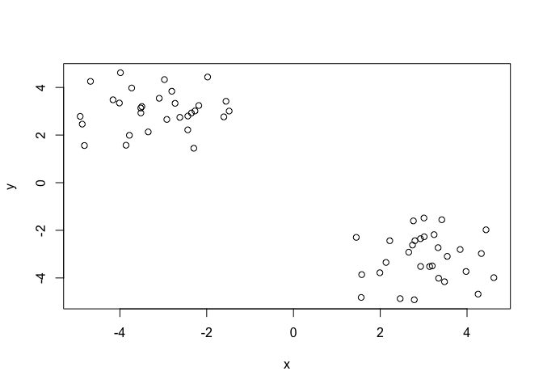
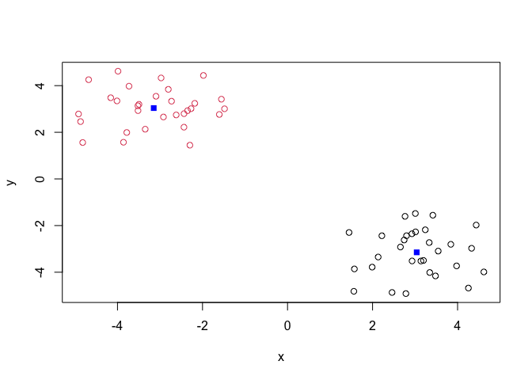
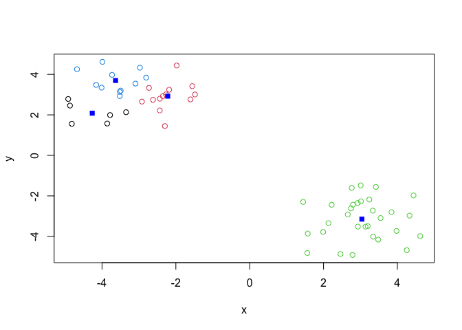
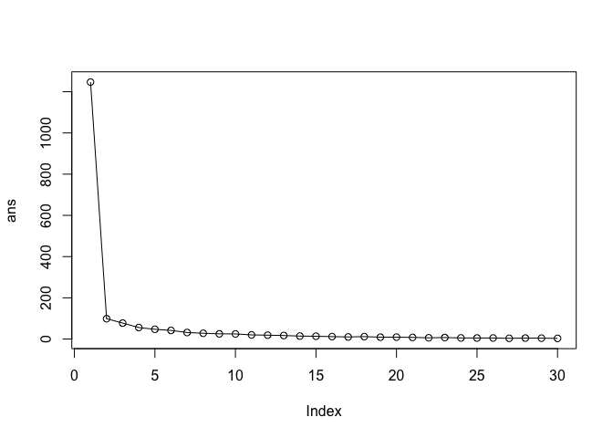
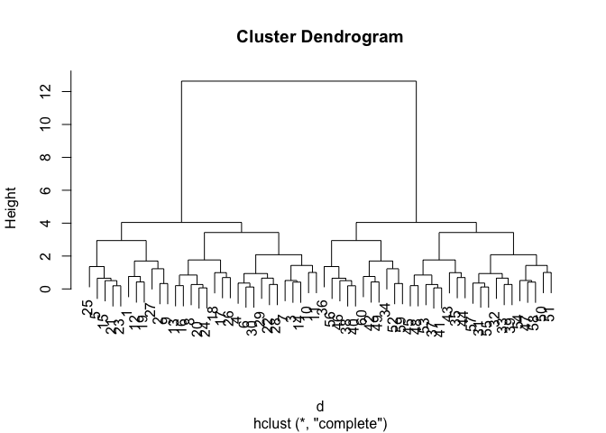
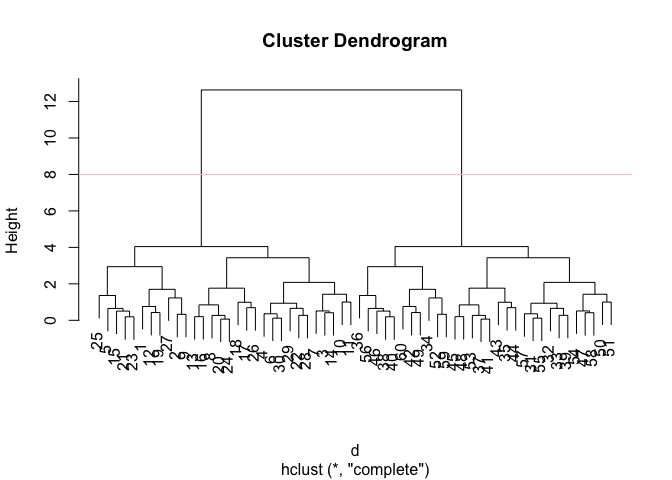
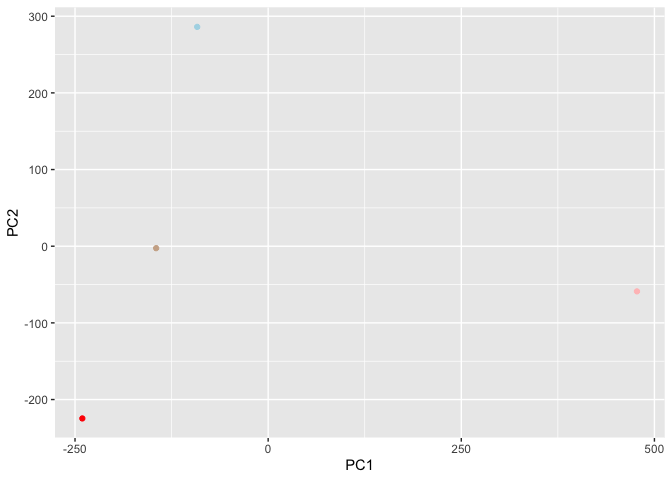
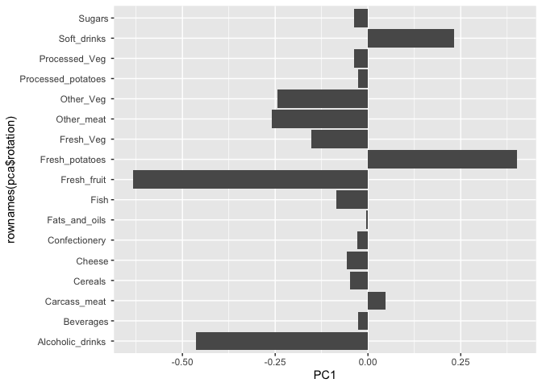

# class07
Paige Contrersas (A16850883)

## Background

Today we will begin our exploration of some important machine learning
methods, namely **clustering** and **dimensionality reduction**.

Let’s make up some input data for clustering where we know what the
natural “clusters” are.

The function `rnorm()` can be useful here. \## K-means clustering

``` r
hist( rnorm(5000) )
```



> Q. Generate 30 random numbers centered at +3 and another 30 centered
> at -3

``` r
rnorm(30, mean = 3)
```

     [1] 3.8217615 2.9075970 2.2091991 1.8375144 1.8093009 2.4929397 2.7772924
     [8] 2.5273977 4.0656303 3.9019723 3.2106615 2.3356025 5.9000555 3.4208126
    [15] 5.0610947 2.9640300 2.4799324 3.0350154 1.8897613 1.6656779 4.4979176
    [22] 0.7922321 4.0352856 2.0441580 2.7941421 1.4996687 3.0244404 4.0367926
    [29] 2.5501538 1.5806868

``` r
rnorm(30, mean = -3)
```

     [1] -2.294333 -3.028348 -3.686165 -2.753416 -3.709864 -1.563983 -2.767210
     [8] -3.809635 -1.744672 -3.533773 -3.629331 -4.143903 -2.874603 -5.430443
    [15] -3.501939 -1.328568 -1.067240 -1.954122 -2.737503 -3.797013 -6.031602
    [22] -2.668463 -2.644406 -3.196841 -2.412142 -2.413348 -2.853653 -3.868691
    [29] -2.587849 -2.286218

``` r
tmp <- c(rnorm(30, mean = 3),
rnorm(30, mean =-3) )

cbind(x=tmp, y =rev(tmp))
```

                  x         y
     [1,]  2.131927 -3.347994
     [2,]  2.784126 -4.916352
     [3,]  3.544007 -3.094001
     [4,]  3.240561 -2.181822
     [5,]  2.219109 -2.436335
     [6,]  3.011910 -2.270132
     [7,]  3.332985 -2.728793
     [8,]  2.929633 -3.516801
     [9,]  2.458753 -4.868634
    [10,]  4.437481 -1.978751
    [11,]  4.329454 -2.974265
    [12,]  1.572363 -3.859047
    [13,]  3.480752 -4.159378
    [14,]  3.841063 -2.804298
    [15,]  2.656290 -2.919027
    [16,]  3.345104 -4.012210
    [17,]  3.976579 -3.728804
    [18,]  4.254647 -4.678682
    [19,]  1.990846 -3.781863
    [20,]  3.197870 -3.495185
    [21,]  2.743170 -2.618804
    [22,]  3.006909 -1.482248
    [23,]  2.798585 -2.434820
    [24,]  3.136993 -3.519212
    [25,]  1.446928 -2.296643
    [26,]  4.618280 -3.987927
    [27,]  1.560344 -4.818487
    [28,]  2.763759 -1.604457
    [29,]  3.418141 -1.555741
    [30,]  2.926366 -2.352208
    [31,] -2.352208  2.926366
    [32,] -1.555741  3.418141
    [33,] -1.604457  2.763759
    [34,] -4.818487  1.560344
    [35,] -3.987927  4.618280
    [36,] -2.296643  1.446928
    [37,] -3.519212  3.136993
    [38,] -2.434820  2.798585
    [39,] -1.482248  3.006909
    [40,] -2.618804  2.743170
    [41,] -3.495185  3.197870
    [42,] -3.781863  1.990846
    [43,] -4.678682  4.254647
    [44,] -3.728804  3.976579
    [45,] -4.012210  3.345104
    [46,] -2.919027  2.656290
    [47,] -2.804298  3.841063
    [48,] -4.159378  3.480752
    [49,] -3.859047  1.572363
    [50,] -2.974265  4.329454
    [51,] -1.978751  4.437481
    [52,] -4.868634  2.458753
    [53,] -3.516801  2.929633
    [54,] -2.728793  3.332985
    [55,] -2.270132  3.011910
    [56,] -2.436335  2.219109
    [57,] -2.181822  3.240561
    [58,] -3.094001  3.544007
    [59,] -4.916352  2.784126
    [60,] -3.347994  2.131927

``` r
cbind(letters, rev(letters))
```

          letters    
     [1,] "a"     "z"
     [2,] "b"     "y"
     [3,] "c"     "x"
     [4,] "d"     "w"
     [5,] "e"     "v"
     [6,] "f"     "u"
     [7,] "g"     "t"
     [8,] "h"     "s"
     [9,] "i"     "r"
    [10,] "j"     "q"
    [11,] "k"     "p"
    [12,] "l"     "o"
    [13,] "m"     "n"
    [14,] "n"     "m"
    [15,] "o"     "l"
    [16,] "p"     "k"
    [17,] "q"     "j"
    [18,] "r"     "i"
    [19,] "s"     "h"
    [20,] "t"     "g"
    [21,] "u"     "f"
    [22,] "v"     "e"
    [23,] "w"     "d"
    [24,] "x"     "c"
    [25,] "y"     "b"
    [26,] "z"     "a"

``` r
x <- cbind(x = tmp, y=rev(tmp))
plot(x)
```



## K means clustering

The main function in “base R” for K-means clustering is called
`kmeans()`:

``` r
km <- kmeans(x, centers = 2)
```

> Q. What component of the results object details the cluster sizes

``` r
km$size
```

    [1] 30 30

> Q. What component of the results object dtails the cluster centers?

> What component of the results object details the cluster membership
> vector (i.e. our main result of which points lie in which cluster?)

``` r
km$cluster
```

     [1] 1 1 1 1 1 1 1 1 1 1 1 1 1 1 1 1 1 1 1 1 1 1 1 1 1 1 1 1 1 1 2 2 2 2 2 2 2 2
    [39] 2 2 2 2 2 2 2 2 2 2 2 2 2 2 2 2 2 2 2 2 2 2

> Q. Plot our clustering results with points colors by cluster and also
> add the cluster centers as new points colored blue?

``` r
plot(x, col=km$cluster )
points(km$centers, col="blue", pch = 15)
```



> Q. Run `kmeans()` again and this time produce 4 clusters (and call
> your result object `k4`) and make a results figure like above?

``` r
k4 <- kmeans(x, centers = 4)
plot(x, col=k4$cluster )
points(k4$centers, col="blue", pch = 15)
```



the meteric

``` r
km$tot.withinss
```

    [1] 98.79615

``` r
k4$tot.withinss
```

    [1] 67.11078

``` r
ans <- NULL
for(i in 1:30) {
ans <- c(ans, kmeans(x, centers = i)$tot.withinss)
}


ans
```

     [1] 1246.767512   98.796149   77.281688   55.767227   47.319661   41.738319
     [7]   31.703884   27.982351   25.256595   24.735899   20.037007   18.762945
    [13]   17.074060   14.407328   13.472103   11.754913   10.121630   11.795519
    [19]    9.020294    9.214323    7.896363    6.007800    7.249658    5.347854
    [25]    5.057350    5.041093    3.536338    4.710251    4.175651    3.112001

``` r
plot(ans, typ = "o")
```



**Key-point:** K-means will impose a clustering structure on your data
even if it is not there - it will always give you the answer you asked
for even if that anwer is silly!

\##Hierarchical Clustering

The main function for Hierarchical Clustering is called `hclust()`
unlike `kmeans()` (which does all the work for you) you can’t just pass
`hclust()` our raw input data. It needs a “distance matrix” like the one
returned from the `dist()` function.

``` r
d <- dist(x)
hc <- hclust(d)
plot(hc)
```



To extract our cluster membership vector from a `hclust()` result object
we have to “cut” our tree at a given height to yield separate
“groups”/“branches”.

``` r
plot(hc)
abline(h=8, col="pink", lty=)
```



to do this we use the `cutree()` function on our `hclust()` object:

``` r
grps <- cutree(hc, h=8)
grps
```

     [1] 1 1 1 1 1 1 1 1 1 1 1 1 1 1 1 1 1 1 1 1 1 1 1 1 1 1 1 1 1 1 2 2 2 2 2 2 2 2
    [39] 2 2 2 2 2 2 2 2 2 2 2 2 2 2 2 2 2 2 2 2 2 2

``` r
table(grps, km$cluster)
```

        
    grps  1  2
       1 30  0
       2  0 30

## PCA of UK food data

Import the dataset of food consumption in the UK

``` r
url <- "https://tinyurl.com/UK-foods"
x <- read.csv(url)
x
```

                         X England Wales Scotland N.Ireland
    1               Cheese     105   103      103        66
    2        Carcass_meat      245   227      242       267
    3          Other_meat      685   803      750       586
    4                 Fish     147   160      122        93
    5       Fats_and_oils      193   235      184       209
    6               Sugars     156   175      147       139
    7      Fresh_potatoes      720   874      566      1033
    8           Fresh_Veg      253   265      171       143
    9           Other_Veg      488   570      418       355
    10 Processed_potatoes      198   203      220       187
    11      Processed_Veg      360   365      337       334
    12        Fresh_fruit     1102  1137      957       674
    13            Cereals     1472  1582     1462      1494
    14           Beverages      57    73       53        47
    15        Soft_drinks     1374  1256     1572      1506
    16   Alcoholic_drinks      375   475      458       135
    17      Confectionery       54    64       62        41

> Q1. How many rows and columns are in your new data frame named x? What
> R functions could you use to answer this questions?

``` r
dim(x)
```

    [1] 17  5

One solution to set the row names is to do it by hand…

``` r
rownames(x) <- x[,1]
```

To remove the first column I can use the minus index trick

``` r
x <- x[,-1]
x
```

                        England Wales Scotland N.Ireland
    Cheese                  105   103      103        66
    Carcass_meat            245   227      242       267
    Other_meat              685   803      750       586
    Fish                    147   160      122        93
    Fats_and_oils           193   235      184       209
    Sugars                  156   175      147       139
    Fresh_potatoes          720   874      566      1033
    Fresh_Veg               253   265      171       143
    Other_Veg               488   570      418       355
    Processed_potatoes      198   203      220       187
    Processed_Veg           360   365      337       334
    Fresh_fruit            1102  1137      957       674
    Cereals                1472  1582     1462      1494
    Beverages                57    73       53        47
    Soft_drinks            1374  1256     1572      1506
    Alcoholic_drinks        375   475      458       135
    Confectionery            54    64       62        41

A better way to do this is to set the row names to the first column by
arguing with `read.csv()`

``` r
x <- read.csv(url, row.names = 1)
x
```

                        England Wales Scotland N.Ireland
    Cheese                  105   103      103        66
    Carcass_meat            245   227      242       267
    Other_meat              685   803      750       586
    Fish                    147   160      122        93
    Fats_and_oils           193   235      184       209
    Sugars                  156   175      147       139
    Fresh_potatoes          720   874      566      1033
    Fresh_Veg               253   265      171       143
    Other_Veg               488   570      418       355
    Processed_potatoes      198   203      220       187
    Processed_Veg           360   365      337       334
    Fresh_fruit            1102  1137      957       674
    Cereals                1472  1582     1462      1494
    Beverages                57    73       53        47
    Soft_drinks            1374  1256     1572      1506
    Alcoholic_drinks        375   475      458       135
    Confectionery            54    64       62        41

> Q2. Which approach to solving the ‘row-names problem’ mentioned above
> do you prefer and why? Is one approach more robust than another under
> certain circumstances?

### Spotting major differences and trends

is difficult even in this wee 17d dataset…

``` r
barplot(as.matrix(x), beside=T, col=rainbow(nrow(x)))
```


``` r
barplot(as.matrix(x), beside=F, col=rainbow(nrow(x)))
```


``` r
pairs(x, col=rainbow(nrow(x)), pch=16)
```


``` r
library(pheatmap)
pheatmap( as.matrix(x) )
```


\##PCA to the rescue

The main PCA function in “base R” is called `prcomp()`. This function
wants the transpose of our food data as inout (i.e. the foods as columns
and the countries as rows).

``` r
pca <- prcomp( t(x) )
```

``` r
summary(pca)
```

    Importance of components:
                                PC1      PC2      PC3     PC4
    Standard deviation     324.1502 212.7478 73.87622 2.7e-14
    Proportion of Variance   0.6744   0.2905  0.03503 0.0e+00
    Cumulative Proportion    0.6744   0.9650  1.00000 1.0e+00

``` r
attributes(pca)
```

    $names
    [1] "sdev"     "rotation" "center"   "scale"    "x"       

    $class
    [1] "prcomp"

To make one of main PCA result figures we turn to `pca$x` the scores
along our new PCs. This is called “PC plot” or “score plot” or
“Ordienation plot”…

``` r
pca$x
```

                     PC1         PC2        PC3           PC4
    England   -144.99315   -2.532999 105.768945  1.612425e-14
    Wales     -240.52915 -224.646925 -56.475555  4.751043e-13
    Scotland   -91.86934  286.081786 -44.415495 -6.044349e-13
    N.Ireland  477.39164  -58.901862  -4.877895  1.145386e-13

``` r
my_cols <- c("peachpuff3", "red", "lightblue", "rosybrown1")
```

``` r
library(ggplot2)
ggplot(pca$x) +
aes(PC1, PC2,) +
geom_point(col=my_cols)
```



The second major result figure is called a “loading plot” of “variable
contributions plot” or “weight plot”

``` r
ggplot(pca$rotation) +
aes(PC1, rownames(pca$rotation)) +
geom_col()
```


