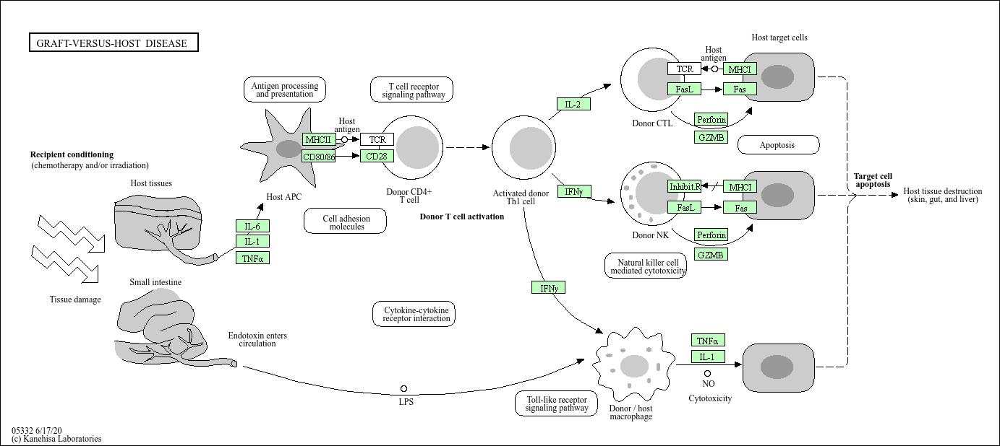

## Background

Today we will explore an RNASeq analysis on the effects of dexamethasone (hereafter "dex"), a common steroid on airway smooth muscle (ASM) cell lines.

## Data Import

We need two things for this analysis:

- **count Data:
samples/experiments as columns, 
- **colData: metadata about the columns (i.e. samples) in the main countData object.

```{r import}
counts <- read.csv("airway_scaledcounts.csv", row.names=1)
metadata <- read.csv("airway_metadata.csv")
```

```{r}
metadata
```


```{r}
head(counts)
```

## Check on metadata counts corespondance

We need to check that the metadata matches the samples in our count data.

```{r}
ncol(counts) == nrow(metadata)
```

```{r}
colnames(counts) == metadata$id
```

```{r}
all( c(T,T,F,T) )
```

> Q1. How many genes are in this dataset?

```{r}
nrow(counts)
```

> Q2. How many "control" samples are in this dataset?

```{r}
sum( metadata$dex == "control")
```

## Analysis Plan...

We have 4 replicates per condition (control and "treated").
We want to compare the control vs the treated to see which genes expression levels change when we have the drug present. 

"we will go row by row (gene by gene) and see if the average value in control columns is different than the average value in treated columns"

- Step 1. Find which columns in `counts` correspond to "control" samples.

- Step 2. Extract/select these columns and calculate an average value for each gene (i.e. each row).

- Step 3. Calculate an average value for each gene (i.e. each row).

```{r}
# The indices (i.e. positions) that are "control"
control.inds <- metadata$dex == "control"
```

```{r}
# Extract these "control" columns from counts
control.counts <- counts[, control.inds]
```

> Q3. How would you make the above code in either approach more robust? Is there a function that could help here? 

```{r}
# Calculate the mean for each gene (i.e. row)
control.mean <- rowMeans(control.counts)
```

 

> Q4. Follow the same procedure for the treated samples (i.e. calculate the mean per gene across drug treated samples and assign to a labeled vector called treated.mean)

> Q. Do the same for "treated" samples - find the mean count value per gene. 

the code below does step 1-3 together
```{r}
treated.mean <- rowMeans( counts[ ,metadata$dex == "treated"] )
```

Let's put these two mean calues into a new data.frame `mean.counts` for easy book-keeping and plotting.

```{r}
meancounts <- data.frame(control.mean,
                         treated.mean)
head(meancounts)
```


> Q5 (a). Create a scatter plot showing the mean of the treated samples against the mean of the control samples. Your plot should look something like the following.
> Q. Make a ggplot of average counts of control vs treated.

```{r}
library(ggplot2)

ggplot(meancounts) +
  aes(control.mean,
      treated.mean) +
  geom_point(alpha=0.3) 
```

> Q5 (b).You could also use the ggplot2 package to make this figure producing the plot below. What geom_?() function would you use for this plot?

We can use geom_point to do this. 


This is screaming to be log transformed... as it i sso highly skewed...

> Q6. Try plotting both axes on a log scale. What is the argument to plot() that allows you to do this?

Using the scale function as we did below
```{r}
ggplot(meancounts) +
  aes(control.mean,
      treated.mean) +
  geom_point(alpha=0.3) +
  scale_x_log10() +
  scale_y_log10()
```

## Log2 units and fold change

If we consider "treated"/"control" counts we will get a number that tells us the change

```{r}
# No change
log2(20/20)
```

```{r}
# A doubling in the treated vs control
log2(40/20)
```

```{r}
log2(10/20)
```

>. Q. Add a new column `log2fc` for log2 fold change of treated/control to our `meancounts` object.

```{r}
meancounts$log2fc <- 
 log2(meancounts$treated.mean/
  meancounts$control.mean)

head(meancounts)
```

## Remove zero count genes

Typically we would not consider zero count genes - as we have no data about them and they should be excluded from further consideration. These lead to "funky" log 2 fold change values (e.g. divide by zero errors etc.)

> Q7. What is the purpose of the arr.ind argument in the which() function call above? Why would we then take the first column of the output and need to call the unique() function?

The purpose of the function gives rows and columns in a dataset indices.
The unique function can be used so that genes are only only output once and not multiple times. 

```{r}
zero.vals <- which(meancounts[,1:2]==0, arr.ind=TRUE)

to.rm <- unique(zero.vals[,1])
mycounts <- meancounts[-to.rm,]
head(mycounts)
```


```{r}
up.ind <- mycounts$log2fc > 2
down.ind <- mycounts$log2fc < (-2)
```


> Q8. Using the up.ind vector above can you determine how many up regulated genes we have at the greater than 2 fc level? 

```{r}
length(up.ind)
```

> Q9. Using the down.ind vector above can you determine how many down regulated genes we have at the greater than 2 fc level? 


```{r}
length(down.ind)
```


> Q10. Do you trust these results? Why or why not?

No, I do not trust these results because they should not be same value. This means that there was an error somewhere.

## DESeq analysis 

We are missing any measure of significance from the work we have so far. Let's do this properly with the **DESeq2** package. 

```{r, message=FALSE}
library(DESeq2)
```

The DESeq2 package, like many bioconductor packages, wants it's input in a very specific way - a data structure setup with all the info it needs for the calculation.

```{r}
dds <- DESeqDataSetFromMatrix( countData = counts,
                        colData = metadata,
                        design = ~dex)
```

The main function in this package is called `DESeq()` it will run the full analysis for us on our `dds` input object:

```{r}
dds <- DESeq(dds)
```

Exract our results:

```{r}
res <- results(dds)
head(res)
```

```{r}
3600 * 0.5
```


## Volcano plot 

A useful summary figure of our results is often called a volcano plot. It is basically a plot of log2 fold change values vs Adjusted P-values.

> Q. Use ggplot to make a first version "volcano plot" of `log2FoldChange` vs `padj` 

```{r}
ggplot(res) +
  aes(log2FoldChange, 
      padj ) +
  geom_point()
```


```{r}
ggplot(res) +
  aes(log2FoldChange, 
      log(padj) ) +
  geom_point()
```

```{r}
log(0.005)
```

This is not very useful the y-axis (P-value) is is not really hepful, we want to focus on low p-value

```{r}
ggplot(res) +
  aes(log2FoldChange, 
      -log(padj) ) +
  geom_point()
```

```{r}
ggplot(res) +
  aes(log2FoldChange, 
      -log(padj) ) +
  geom_point() +
geom_vline(xintercept = c(-2,+2), col="pink") +
  geom_hline(yintercept = -log(0.05), col="lightblue")
```


## Add some plot annotation

> Q. Add color to the points (genes) we care about, nice axis labels, a useful title and a nice theme. 

```{r}
mycols <- rep("lightseagreen", nrow(res))
mycols[ res$log2FoldChange > 2] <- "slateblue2"
mycols[ res$log2FoldChange < -2] <- "royalblue1"
mycols [ res$padj >= 0.05 ] <- "lavenderblush3"

```


```{r}
ggplot(res) +
  aes(log2FoldChange, 
      -log(padj)) + 
  geom_point(col = mycols) +
geom_vline(xintercept = c(-2,+2), col="pink") +
  geom_hline(yintercept = -log(0.05), col="lightblue")
```


## Save our results to a CSV file
```{r}
write.csv(res, file="results.csv")
```


## Add Annotation Data

To make sense of our results we need to know what the differnetially expressed genes are and what biological pathways and process what they are involved in.

Let's start by mapping our ENSEMBLE ids to the more conventional gene symbol.

We will use two bioconductor packages for this "mapping"
**AnnotationDbi** and **org.HS.eg.db**

We will first need to install these from bioconductor with `BiocManager::install()`

```{r}
head(res)
```

```{r}
library(AnnotationDbi)
library(org.Hs.eg.db)
```


```{r}
res$symbol <- mapIds(org.Hs.eg.db,
                     keys = rownames(res), # Our ids
                     keytype= "ENSEMBL", # Their format
                     column = "SYMBOL") # What I want to translate to
```

```{r}
head(res)
```

> Q. Can you ass "GENENAME" amd "ENTREZID" as new columns to res as "name" and "entrez" ?

```{r}
res$name <- mapIds(org.Hs.eg.db,
                   keys = rownames(res), #Our ids
                   keytype = "ENSEMBL", # Their format
                   column = "GENENAME")

res$entrez <- mapIds(org.Hs.eg.db,
                     keys = rownames(res), # Our ids
                     keytype = "ENSEMBL", #Their format
                     column = "ENTREZID")

```

```{r}
head(res)
```

```{r}
write.csv(res, file="results_annotated.csv")
```

## Pathways analysis 

Now we know the gene names (gene synbols) and their entrez IDs we can find out what pathways they are involved in. This is called "pathway analysis" or "gene set enrichment."

We will use the **gage** package and the **pathviewer** package to do this analysis (but there are loads of others).

```{r, message=FALSE}
library(gage)
library(gageData)
library(pathview)
```

Let's see what is in gageData, specifically KEGG pathways:
```{r}
data(kegg.sets.hs)
head(kegg.sets.hs, 2)
```

To run our pathways analysis we will use the **gage()** function. It wants two main inputs: a vector of importance (in our case the log2 fold change values): and the gene sets to check overlap for.

```{r}
foldchange <- res$log2FoldChange
names(foldchange) <- res$symbol
head(foldchange)
```

KEGG speaks entrez (i.e. uses ENTREZID format) not gene symbol format

```{r}
names(foldchange) <- res$entrez
```


```{r}
keggres = gage(foldchange, gsets=kegg.sets.hs)
```

```{r}
head(keggres$less, 5)
```

let's make a figure of one of these pathways with our DEGs highlighted.

```{r}
pathview(foldchange, pathway.id = "hsa05310")
```


> Q. Generate and insert a pathway figure of "Graft-versus-host disease" and "Type 1 Diabetes" ?

```{r}
pathview(foldchange, pathway.id = "hsa05332")
```



```{r}
pathview(foldchange, pathway.id = "hsa04940")
```


